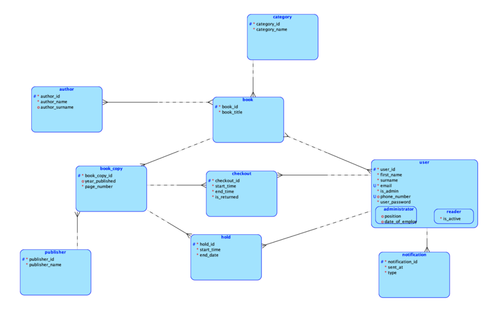
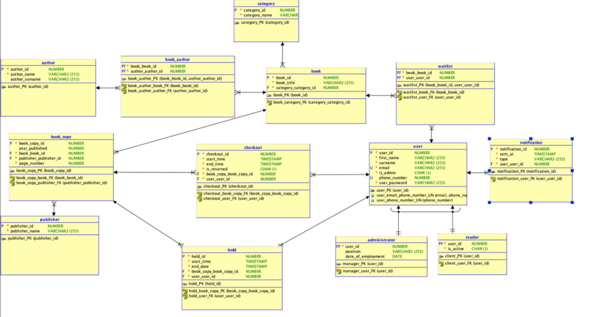
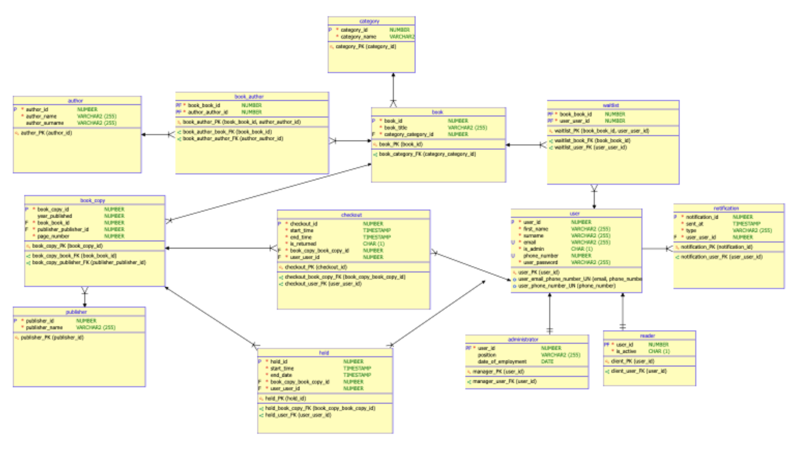
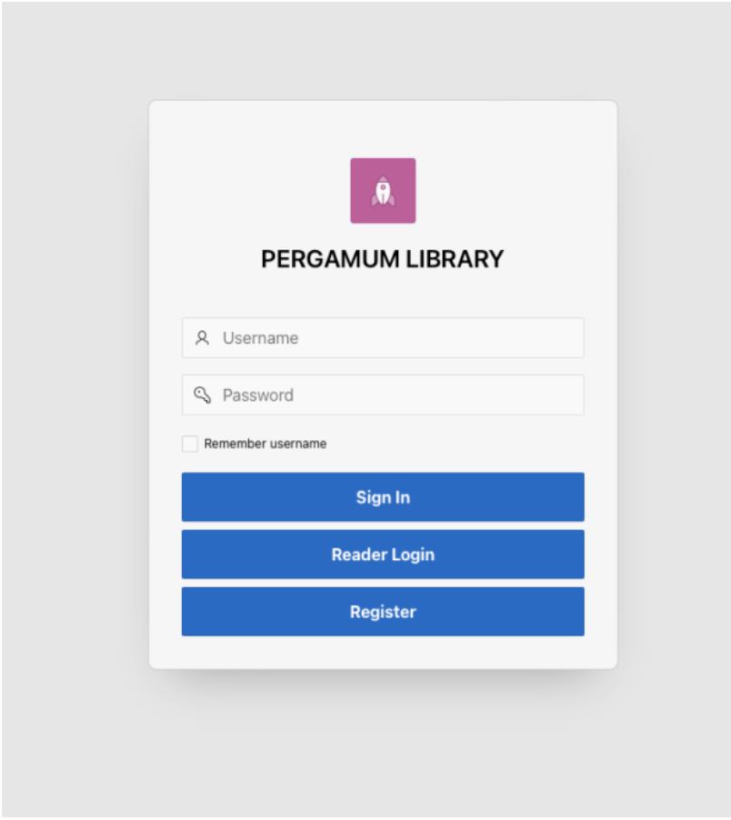
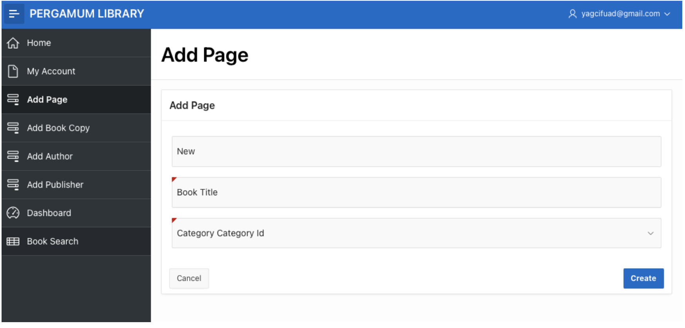
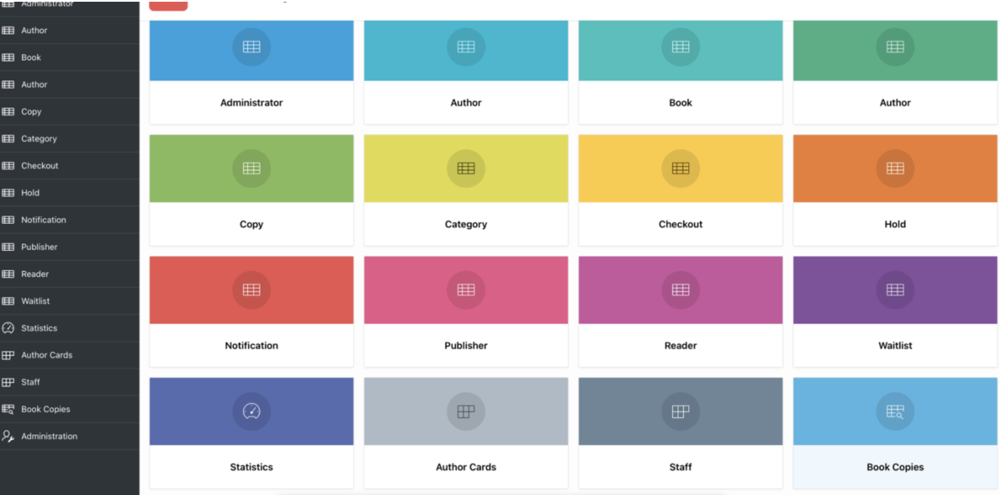
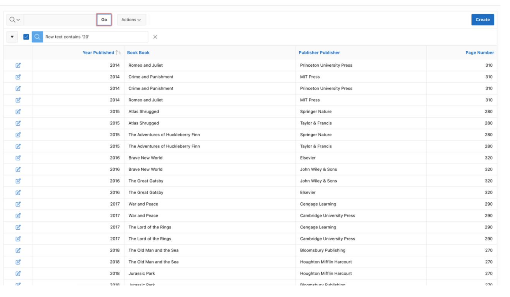

# Pergamum Library Management System
A Oracle APEX-based library management system with interactive user interface and robust database design.

## Overview
Pergamum Library is a full-featured library management system developed using Oracle APEX and Oracle SQL Developer Data Modeler. The system provides separate interfaces for administrators and readers, with features including book management, user management, checkouts, and statistical reporting. 

## Features

### For Administrators
- 👥 Staff management interface
- 📊 Interactive statistical dashboards
- 📚 Book and author management
- 🔄 Checkout tracking
- 📋 Reader management

### For Readers
- 🔍 Interactive book search
- 📖 Book reservation system
- 📱 Personal account management
- 📅 Checkout history
- ⏰ Waitlist functionality

## 🛠️ Technical Stack
- Oracle APEX for application development
- Oracle SQL Developer Data Modeler for database design
- PL/SQL for backend logic
- Interactive Reports and Forms
- Custom HTML/CSS for enhanced UI

## 📋 Database Structure
The system includes the following key entities:
- Users (Administrators and Readers)
- Books and Book Copies
- Authors
- Categories
- Publishers
- Checkouts
- Holds and Waitlists
- Notifications

## Getting Started
### Prerequisites
- Oracle APEX environment
- Oracle SQl Developer Database Modeller
- scr/script2.ddl

### Installation
1. Clone this repository
2. Execute the DDL script (`src/script2.ddl`) in your Oracle environment
3. Import the application into Oracle APEX
4. Configure application settings

## Screenshots
### Logical Database Model

### Physical Database Model

### Relational Database Model

### Login Page 

### Book Add Page

### Manager Main Page
  

### Book Search Page

  
## License
This project is licensed under the MIT License - see the [LICENSE](LICENSE) file for details.
